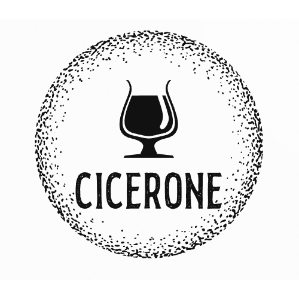

# Concept description

## _TITLE_ and description of the app

### Beer Tracker / Cicerone
*Not sure which title yet...*

The beer tracker promotes healthy and responsible drinking through its features. The features include:
* Tracking the alcohol you have ingested throughout the night.
* Guesstimates the current alcohol percentage in your blood based on your weight, height and sex.
* Includes a search engine for different alcohols.
* Set your preferred time for maximum intoxication and let the app plan your night.
* Save your drink combination and share drink combinations with other people so they can experience your night out!
* Choose your favorite drinks for easy access.

## _WHO_ are the users you have in mind? (Add specifics or characteristics of the users) (> 50 words)
Our primary users are above the restricted age of alcohol consumption in the country they live in. As the app wants to promote healthy and responsible drinking, our users consists of people wanting to scale down their drinking or users who wants to get a better overview of their drinking habits.

## _WHAT_ problem will the app help the users to solve? (Describe various use cases) (> 50 words)
**More control of alcohol consumption**

Users who wants more control of their alcohol consumption can use the app to help track their consumption and intoxication level.

**Scale down drinking**

Users who wants to scale down their drinking can use the app to track their drinks and get recommended times for taking a break or drinking water.

**Plan soberness**

Users who might have plans and who wants to plan their soberness can use the app to set restrictions to plan when to be sober.

## _HOW_ are users solving the problem now? (Without your app) (> 75 words)
Generally the idea of tracking alcohol consumption is not used - they would have to manually track the consumption on a piece of paper or in a note on their phone. This manual tracking would not include the calculations which are included in the app. It can be hard for our users to scale down their drinking, because as you get more intoxicated you might forget how many drinks you have had. It can also be hard to know the alcohol percentage in beer or drinks you get from a bar. For this you can use the app to search for the given drink or contents of the drink.

## _HOW_ can the users solve the problem with your app? (> 75 words)
Using the tracker provided with the app, the user can follow along the alcohol consumption - no data is being lost, because the app is not intoxicated like the user. Constantly being aware of the consumed alcohol will help the user also be aware of their level of intoxiation and therefore might make better decisions. The app will also recommend calling a cab and will provide the number for a local cab company. Providing a list of known alcohols, drinks and beer will help the user understand the alcohol percentage of the drinks they're drinking.

## Show off your application’s _LOGO_:

